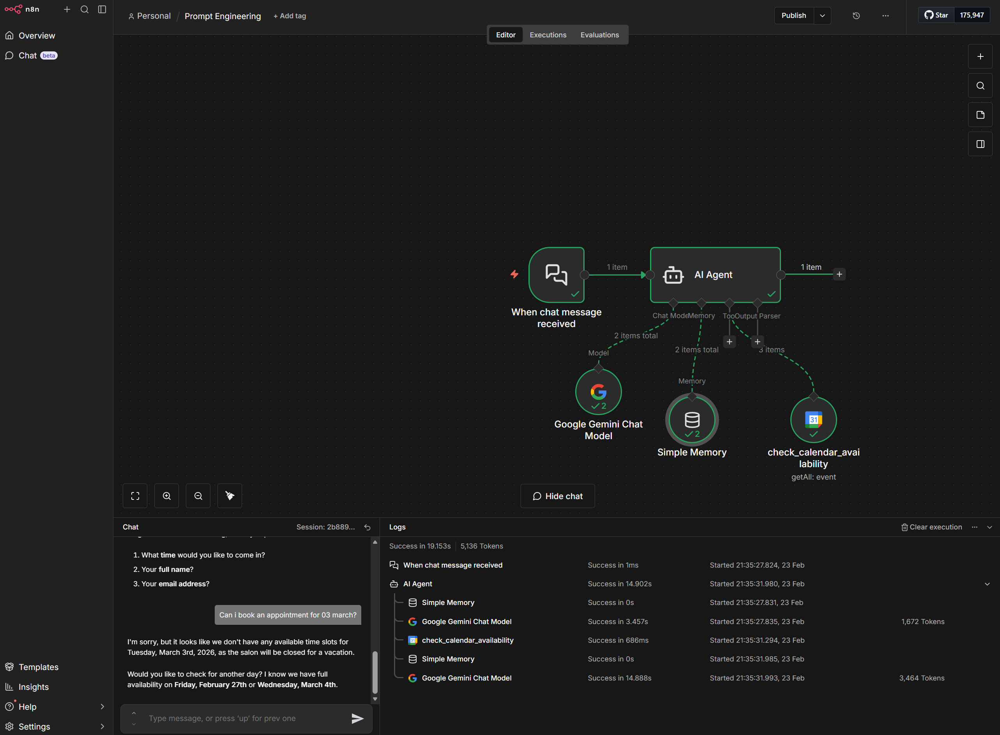

# Prompt Engineering - Calendar Availability

This repository contains an n8n workflow demonstrating advanced prompt engineering with an AI Agent designed to handle calendar availability and schedule appointments. The workflow acts as a scheduling assistant for "Shubham's Perfect Salon".

## Overview

The workflow leverages Google Gemini as its core language model and integrates directly with Google Calendar to read availability and manage bookings. It uses a Chat Trigger to interact with users, guiding them through a step-by-step appointment booking process.

### Screenshot

## Workflow Architecture

The AI agent consists of several interconnected n8n nodes:

- **When chat message received (Chat Trigger):** Initiates the conversation and receives input from the user.
- **AI Agent:** The orchestrator that processes the user's input based on a detailed system prompt and decides which tools to call.
- **Google Gemini Chat Model:** Powered by `models/gemini-3-flash-preview`, this provides the intelligent conversational capabilities.
- **Simple Memory (Window Buffer):** Maintains the context of the conversation so the AI remembers previous questions and answers during the booking session.
- **Google Calendar Tool (`check_calendar_availability`):** A custom-configured tool that allows the agent to check the salon's calendar for existing appointments between 08:59 and 18:01 to find available slots without overlapping.

## Agent Instructions & Prompt Engineering

The AI Agent is guided by a carefully crafted system prompt that instructs it to:

1. Ask the user for their preferred appointment day.
2. Search the Google Calendar for free time slots on the specified day.
3. Present available slots and ask the user to select one.
4. Collect required booking information (Full Name and Email address).
5. Book the appointment using the provided calendar tools.
6. Provide a formatted confirmation summarizing the **Date & Time** and **Email**, along with a cancellation contact number (+91 8319777910).

The prompt also enforces strict adherence to the `UTC+05:30` timezone.

## Installation

1. Open your n8n instance.
2. Go to the **Workflows** interface.
3. Click on the **Import from File...** option.
4. Select `Prompt Engineering - Calendar Availability.json` from the `workflows` directory.
5. Save the workflow.
6. **Important:** Ensure you have configured your credentials for:
   - Google Gemini (PaLM) API
   - Google Calendar OAuth2 API
7. Activate the workflow and test the chat interface!
