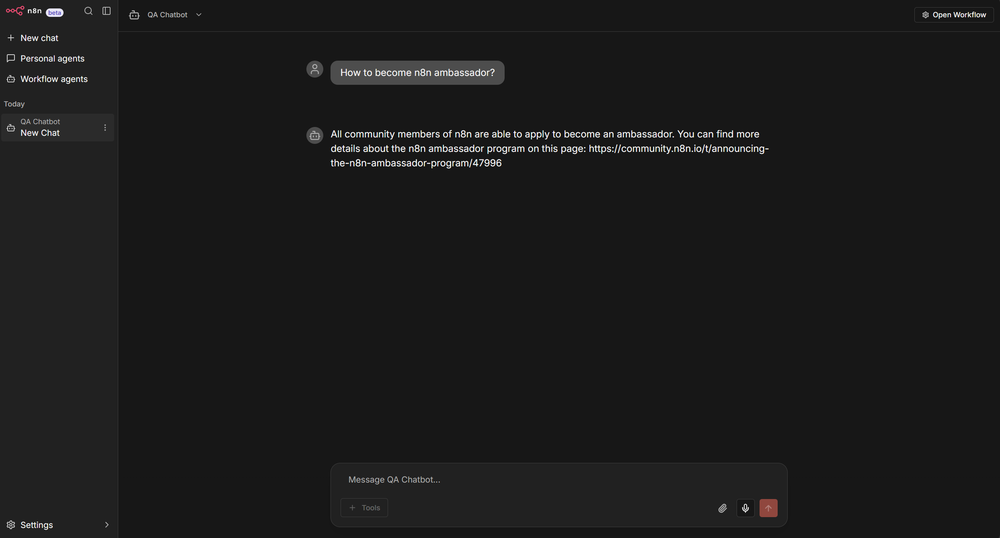
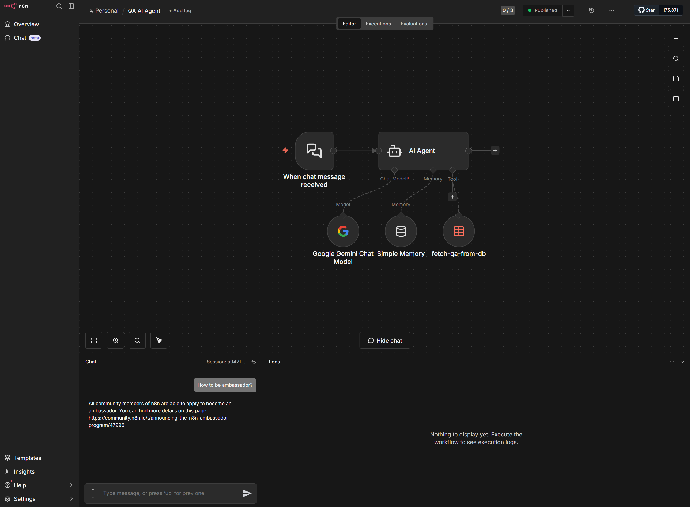
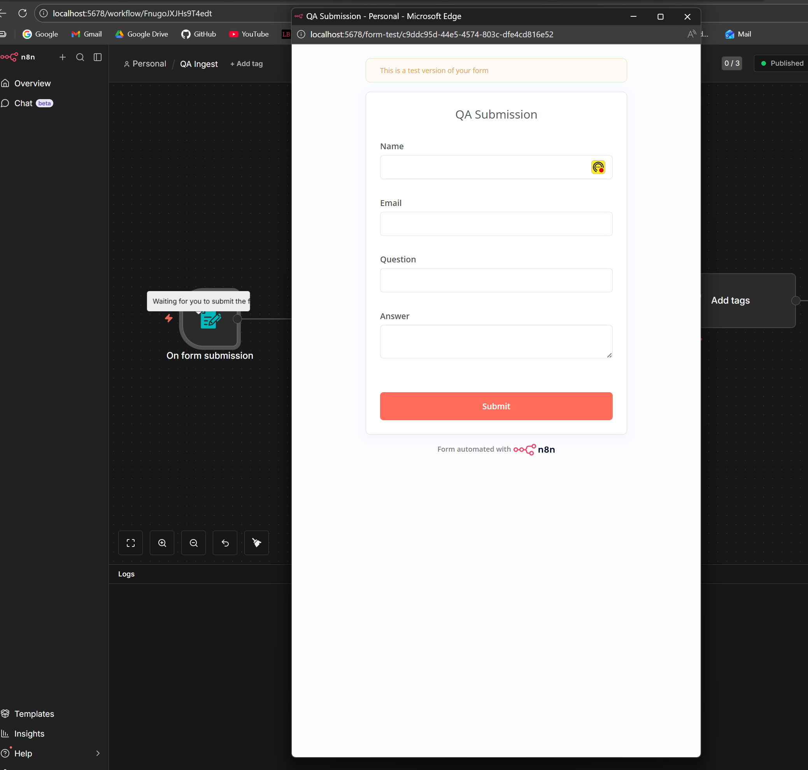
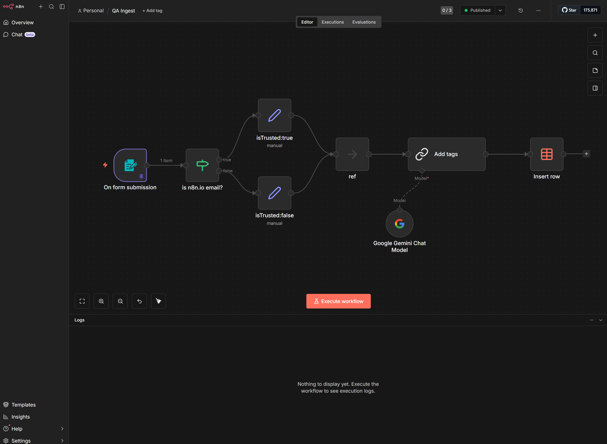
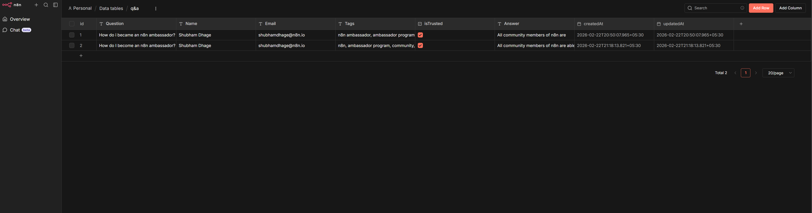
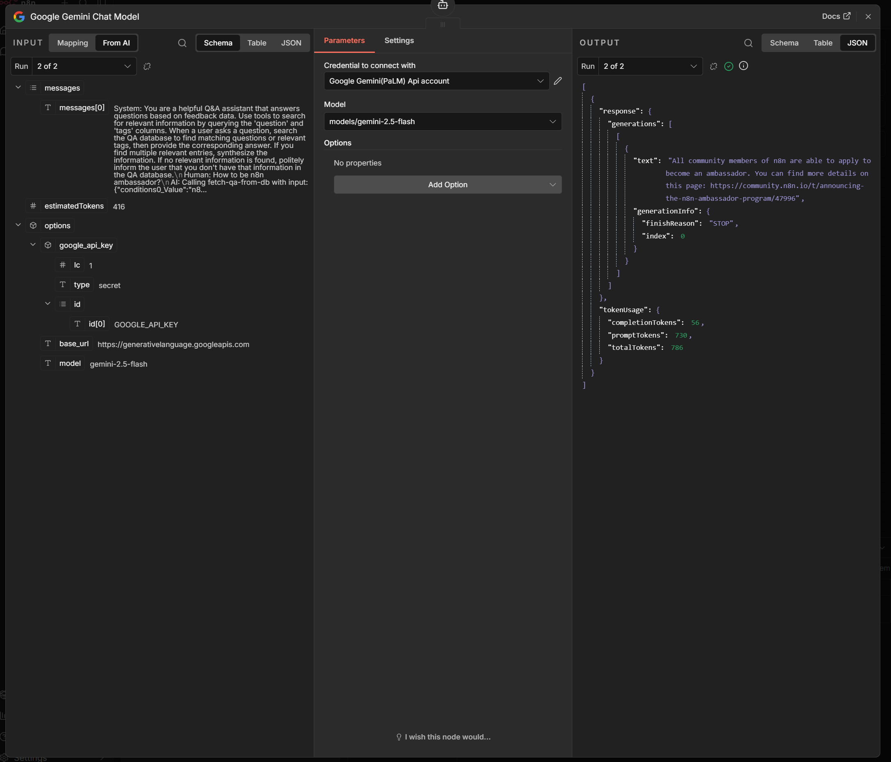

# Q&A Chatbot

## About the Project

This project is an automated AI-powered Q&A system built using **n8n** and **Google Gemini**. It allows users to submit Question & Answer pairs, automatically categorizes them, and provides a conversational chatbot interface to retrieve those answers.

The system consists of two primary n8n workflows:

### 1. QA Ingest Workflow

- **Data Collection:** Uses an n8n form trigger to collect Question and Answer submissions (along with the submitter's Name and Email).
- **Validation:** Automatically checks the submitter's email domain (e.g., `n8n.io`) to mark entries as `isTrusted`.
- **AI Tagging:** Leverages the **Google Gemini Chat Model** to analyze the submitted question and answer, automatically generating 4-8 relevant semantic tags.
- **Storage:** Saves the complete record (Name, Email, Question, Answer, Tags, and Trust Status) into a central n8n Data Table.

### 2. QA AI Agent Workflow

- **Conversational Interface:** Provides a chat interface for users to ask questions.
- **AI Agent:** A LangChain-powered AI Agent equipped with conversational memory and backended by Google Gemini.
- **Knowledge Retrieval Tool:** The agent uses a custom tool to dynamically search the n8n Data Table. It matches the user's query against stored questions and tags, then synthesizes a natural, helpful response based purely on the internal database.

---

## Screenshots

