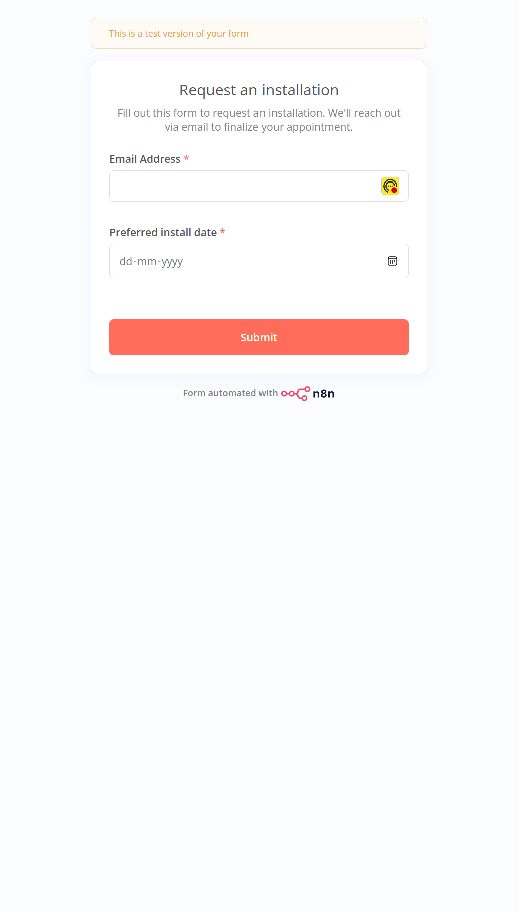
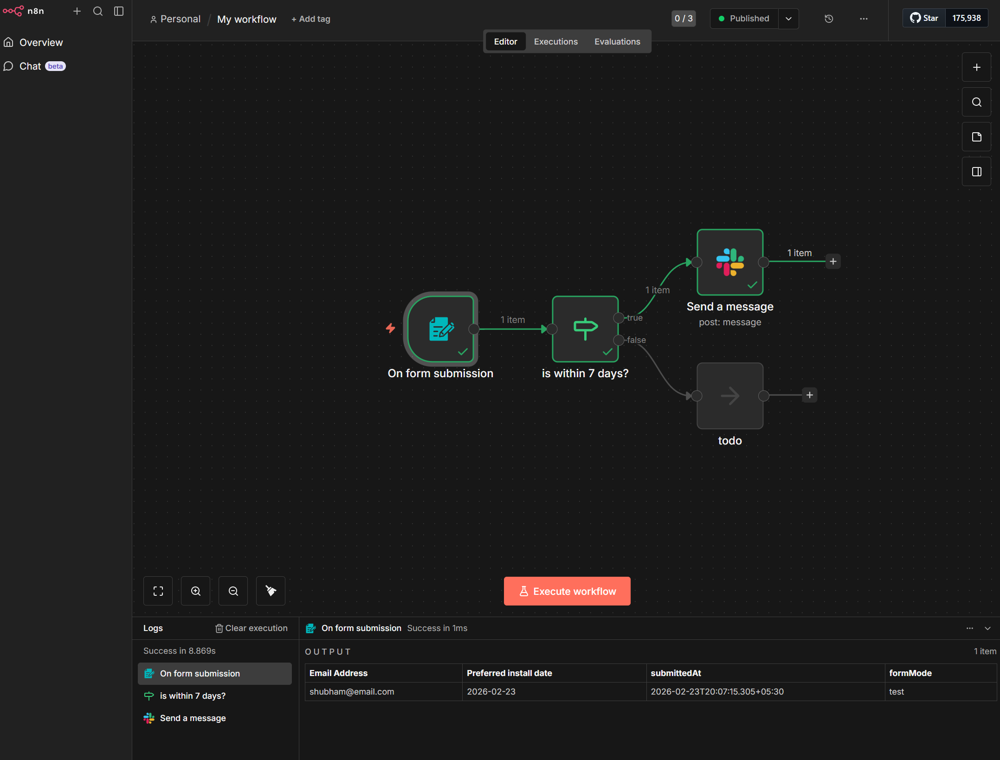
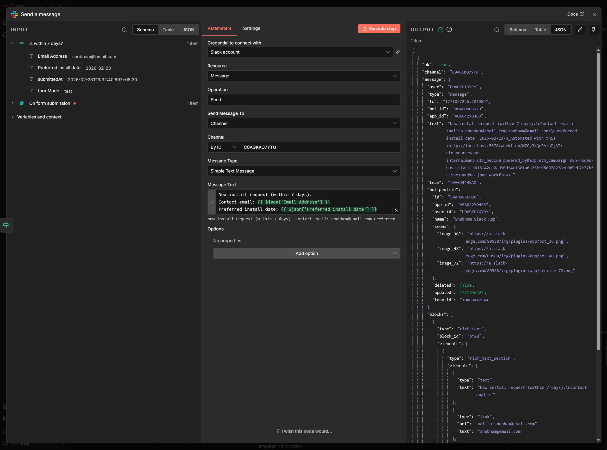
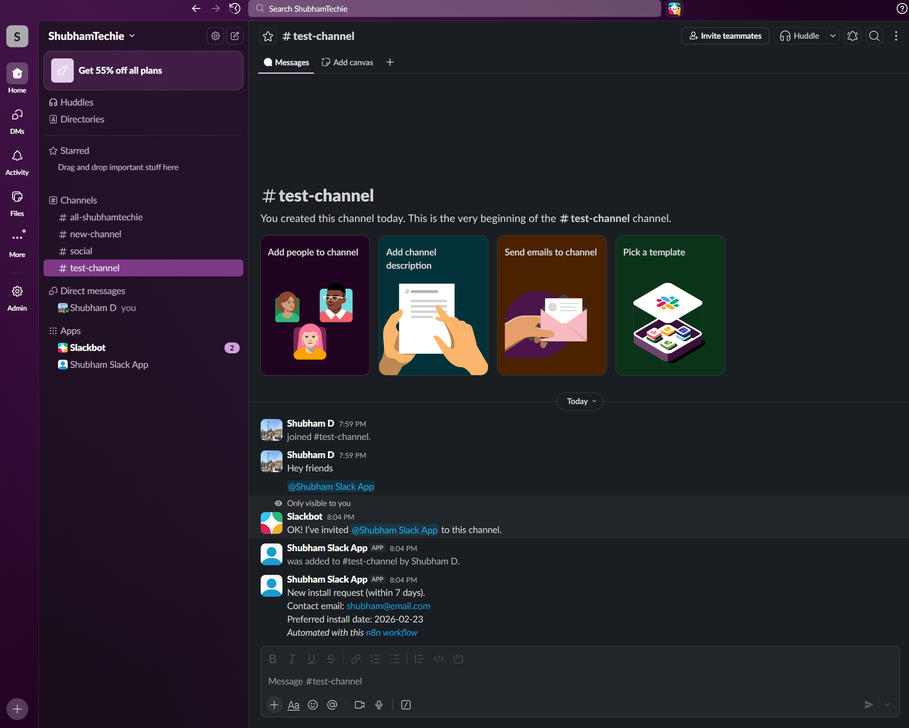

# Request Installation Slack Workflow

This n8n workflow automates the process of handling installation requests through a form submission and sending notifications to a designated Slack channel.

## Workflow Overview

1.  **Form Trigger ("On form submission")**: A user fills out an "Request an installation" form, providing their:
    - Email Address
    - Preferred install date
2.  **Date Validation ("is within 7 days?")**: The workflow uses an `If` node to check if the preferred install date is within the next 7 days.
3.  **Slack Notification ("Send a message")**: If the date is within 7 days, a Slack message is sent to a specific channel detailing the request along with the contact email and preferred date.

## Screenshots

Below are screenshots of the workflow setup and steps:

